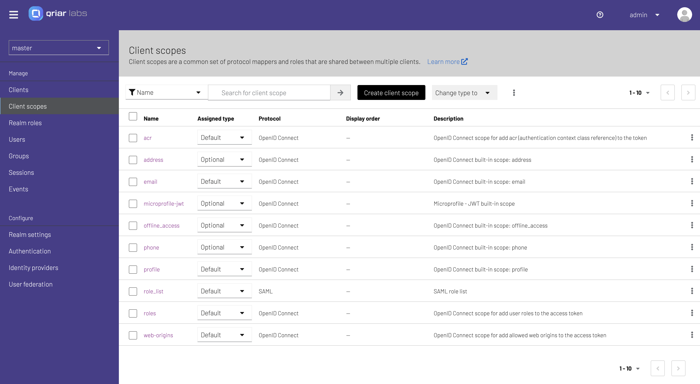

# QIAM Community Edition

QriarLabs IAM Community Edition (QIAM CE) is a plataform built on top of well-known Open Source project Keycloak:

Keycloak is an open source software product to allow single sign-on with identity and access management aimed at modern applications and services.

The platform is a key component for several of our products like:

* QAP
* Managed Cloud - QloudSec
* QSCIM

<!--  -->

# Usage

## Running Locally

You can deploy it easily with the following command:

    git clone https://github.com/qriar-labs/qiam-ce.git

Modify the name of the `.env.example` file to `.env`

    mv .env.example .env

Edit the `.env` file located in the root folder with your own values.

Run the project with the following command

    docker-compose up -d

You can access the QIAM Web UI at: `http://localhost:8080`

### Environment variables

|           Variable           |    Value (example)     |
| :--------------------------: | :--------------------: |
| QIAM_VERSION_TAG           |        latest            |
| QIAM_DATABASE              |        postgres          |
| QIAM_DATABASE_HOST         |        34.148.48.11      |
| QIAM_DATABASE_NAME         |        qiam_dev_db       |
| QIAM_DATABASE_USERNAME     |        qiam              |
| QIAM_DATABASE_PASSWORD     |        qiam              |
| QIAM_DATABASE_PORT         |        5432              |
| QIAM_DATABASE_SCHEMA       |        public            |
| QIAM_ADMIN_USERNAME        |        admin             |
| QIAM_ADMIN_PASSWORD        |        admin             |
| PG_ADMIN_DEFAULT_PASSWORD  |        admin             |
| KEYCLOAK_ENABLE_STATISTICS |        true              |

# Maintenance

## Logging

The Elestio Keycloak Docker image sends the container logs to stdout. To view the logs, you can use the following command:

    docker-compose logs -f

To stop the stack you can use the following command:

    docker-compose down

## Backup and Restore with Docker Compose

To make backup and restore operations easier, we are using folder volume mounts. You can simply stop your stack with docker-compose down, then backup all the files and subfolders in the folder near the docker-compose.yml file.

Creating a ZIP Archive
For example, if you want to create a ZIP archive, navigate to the folder where you have your docker-compose.yml file and use this command:

    zip -r myarchive.zip .

Restoring from ZIP Archive
To restore from a ZIP archive, unzip the archive into the original folder using the following command:

    unzip myarchive.zip -d /path/to/original/folder

Starting Your Stack
Once your backup is complete, you can start your stack again with the following command:

    docker-compose up -d

That's it! With these simple steps, you can easily backup and restore your data volumes using Docker Compose.

_P.S - Keep watching this repository for upcoming great news ;)_
