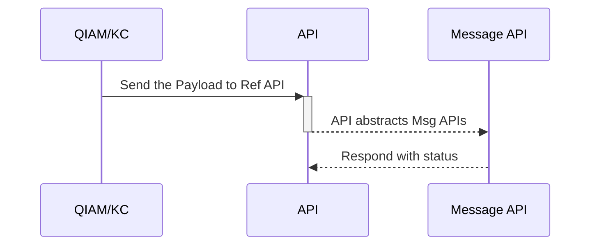
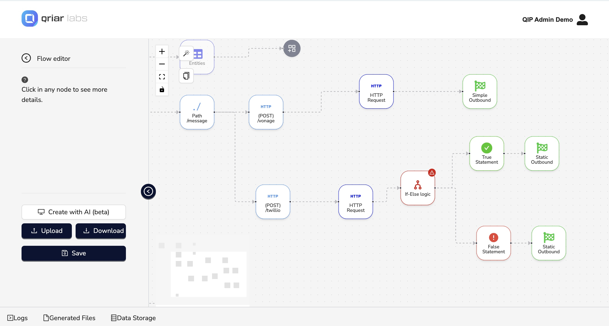
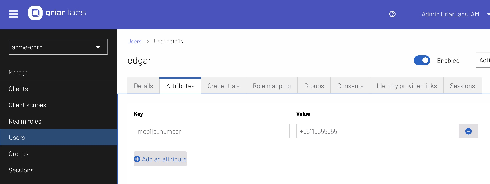
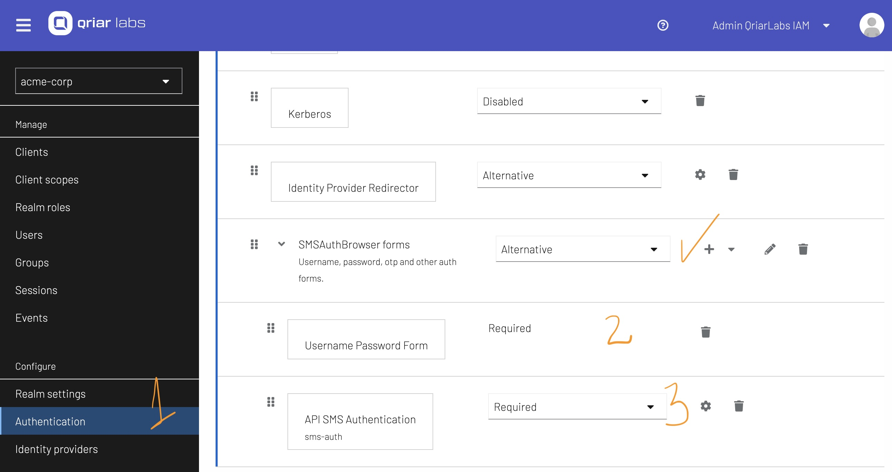
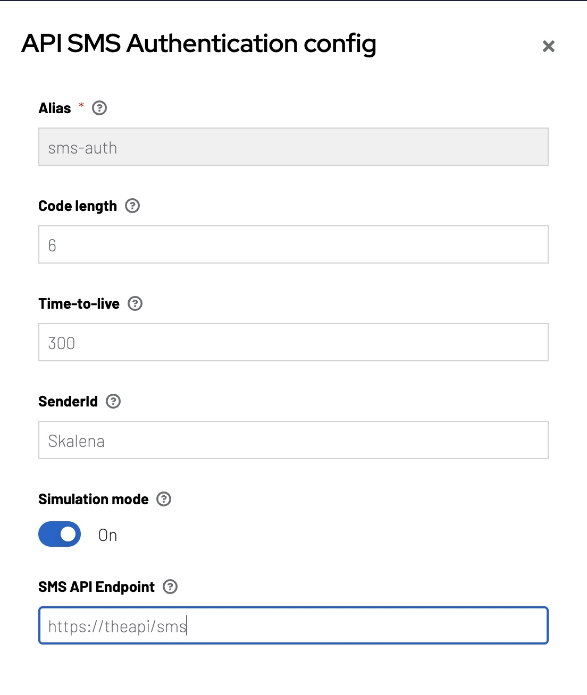

# API Sms MFA

This extension, created by QriarLabs, invokes third party APIs to allow users to choose different messaging solutions for MFA. The goal is to allow you to choose from several SMS, WhatsApp, or Telegram APIs, including: 
* Twilio
* Vonage
* Sendpulse 
* Telegram


## How It Works

You must provide a reference API that will be a common abstraction for messaging (SMS/WhatsApp). The common payload to send to this API is simple: 

```js title="json.payload"
{
  "mobile": "+5511966191717",
  "totp": "32232"
}
```

* mobile: The user's phone number
* totp: The message that will be sent 

Here a diagram to explain this flow: 



For our reference implementation, we are using our own integration platform (QIP) in order to create an abstaction on top of the messaging provider: 



## Adding Mobile Attribute for User

We are using a default attribute (`mobile_number`) to store and manage the QIAM user. The user phone number should use the standard: `+countrycode+phone`. For example: a number from Brazil should be formatted as +551155555555.



## Configuring the Browser Authentication Flow

This is the configuration for Browser Flow using the API Sms MFA:



1. Authentications Flow

2. Authenticating identity via username or email and password

3. If this authentication works, a SMS Token will be send to the user

## Configuring the API Sms MFA

We have to configure the Messaging API endpoint, as well other things such as number of characters for the token, how long the token will be valid etc:



## Testing the API Sms MFA

Follow the extension test bellow: 

[QIAM API Sms MFA](https://app.guidde.com/playbooks/gRiaTVKhR74DyodW5Gbqtt)
===========================================================================

[Click here to watch](https://app.guidde.com/share/playbooks/gRiaTVKhR74DyodW5Gbqtt)

### 

This is a demonstration how our QriarLabs Identity Access Manager can use dynamic APIs for sending MFA Tokens

### Go to [localhost:8080](http://localhost:8080)

### 1\. Click "Sign in"


### 2\. Enter the username


### 3\. Enter the password

![Fill '[password]'](https://static.guidde.com/v0/qg%2FjROEQTCQdjb1TSow8xRZCKdyjlp2%2FgRiaTVKhR74DyodW5Gbqtt%2FwocoKdETECDpcSwHTSctTW_doc.png?alt=media&token=4a33d5ac-d8a4-46ca-9055-f70c78cdae8b)

### 4\. Click "Sign In"


### 5\. Enter the received token

Fill in the text box with the token you recieved in your SMS


### 6\. Click "Submit"


### 7\. Click "Personal info"

As you can see, after the token is accepted by QIAM, you will be able to access the app. You can check your user information by clicking "Personal info".


