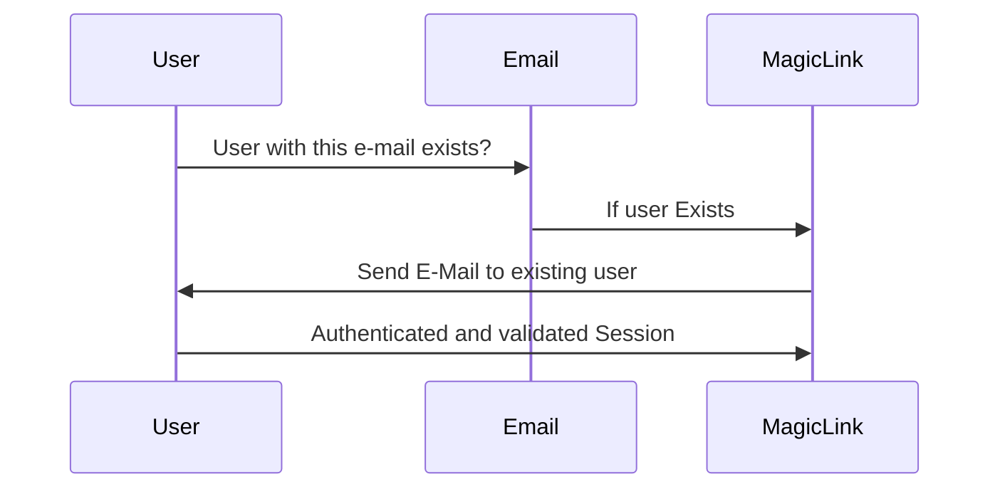
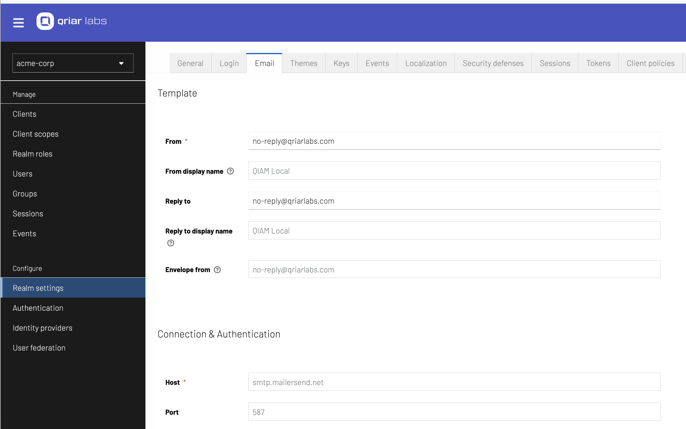
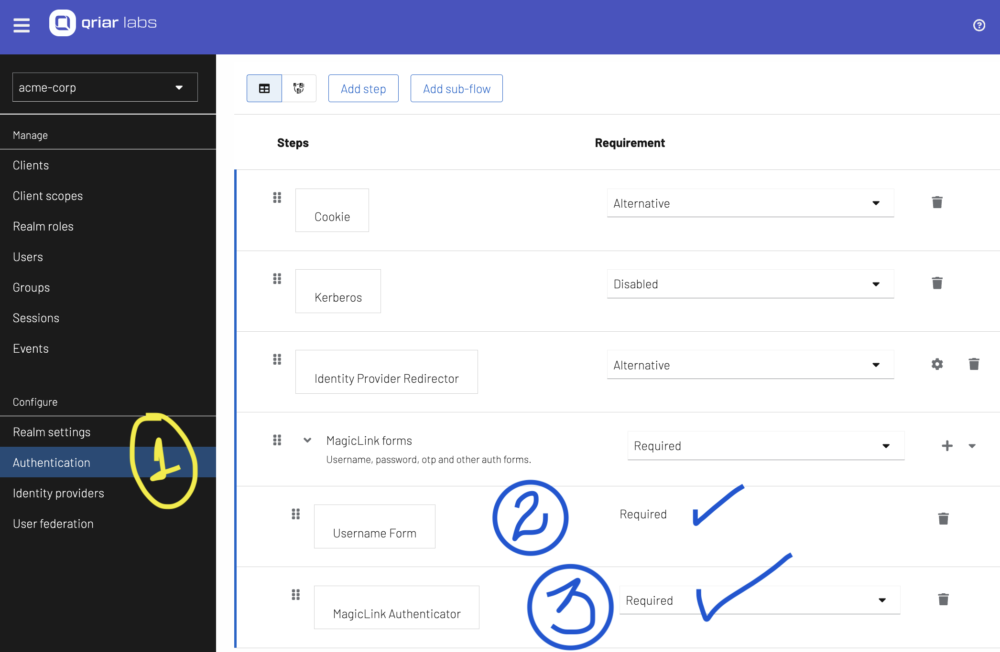

# Magic Link 

Magic Link Authorization is a secure and user-friendly authentication method designed for QIAM. It simplifies the login process by sending a one-time-use link to the user’s email, allowing them to authenticate without the need for passwords. This approach enhances security while providing a seamless user experience. See the following flow:

## How It Works

* **User Initiates Login**: The user enters their email address on the QIAM login page and requests access.

* **Magic Link Generation**: The QIAM generates a unique, time-sensitive magic link and sends it to the user's email.

* **User Clicks the Link**: The user receives the email and clicks the magic link, which redirects them to the QIAM.

* **Automatic Authentication**: Upon clicking the link, the user is automatically authenticated and granted access to the application.

## Benefits

* **Enhanced Security**: Magic links reduce the risk of password-related attacks, such as phishing and brute force, as users don’t need to remember or enter passwords.

* **Improved User Experience**: Users enjoy a hassle-free login process without the frustration of forgotten passwords or complex authentication steps.

* **Time-Limited Access**: Magic links are valid for a short duration, reducing the risk of unauthorized access if the link is compromised.

* **Reduced IT Support Load**: Fewer password resets and login issues translate to lower support costs and improved operational efficiency.

## Configuring MagicLink in QIAM

The first step is to make sure that you Realm has the e-mail properly configured: 

Now, it's time to change the Authentication/Browser Flow:

1- Into your Realm, go to Authentication Left Menu

2- We will use just the user form, as we don't require the password, as the link will be the authorizing the user according his e-mail. If the user exists, an e-mail will be sent. [ Required ]

3- Add the Flow "MagicLink Authenticator" as Required.

## Demonstration

[Configuring the Magic Link](https://app.guidde.com/playbooks/vYj9NoMJtbyZU4zUNkbSK8)
==============================================================

[Click here to watch](https://app.guidde.com/share/playbooks/vYj9NoMJtbyZU4zUNkbSK8)

### 

### Go to [localhost:8080](http://localhost:8080)

### 1\. Click "Authentication"

Click on "Authentication"

[Learn more](https://app.guidde.com/playbooks/vYj9NoMJtbyZU4zUNkbSK8#uP7sNqDteR6Toyr5Q9JxCF)  

### 2\. Click "MagicLink"

Navigate to "MagicLink"

[QIAM Magic Link Demonstration](https://app.guidde.com/playbooks/mC8YVYB4VAzTGTYmRC2hEi)
========================================================================================

[Click here to watch](https://app.guidde.com/share/playbooks/mC8YVYB4VAzTGTYmRC2hEi)

### 

### Go to [localhost:8080](http://localhost:8080)

### 1\. Click "Sign in"

Click on "Sign in"

### 2\. Click "Username or email"

Navigate to "Username or email"

### 3\. Fill with the user name

Fill in with the user name

### 4\. Click "Sign In"

Select the "Sign In" option

### 5\. Click "We've mailed you a passwordless login link. See your emais inbox for details."

As you can see, the QIAM Login Page will inform you that a magic link was sent, time to check your e-mail

### 6\. Switch to "mail.google.com"

Navigate to "mail.google.com" in your web browser.

### 7\. Click "QIAM Passwordless for Login"

Click on the "QIAM Passwordless for Login" field

### 8\. Click "Click to sign in"

Open the email, sent by QIAM as your magic link and click on the "Click to sign in" button.

### 9\. Switch to "localhost:8080"

And now, your session is properly authenticated

### 10\. Click on profile link on the top

Check the Profile Option

### 11\. Click "Personal info"

Select Personal Info, and check the authenticated user's information

Explore the QIAM Magic Link feature through a step-by-step demonstration. Learn how to sign in, access emails for passwordless login, and navigate personal information effortlessly.

